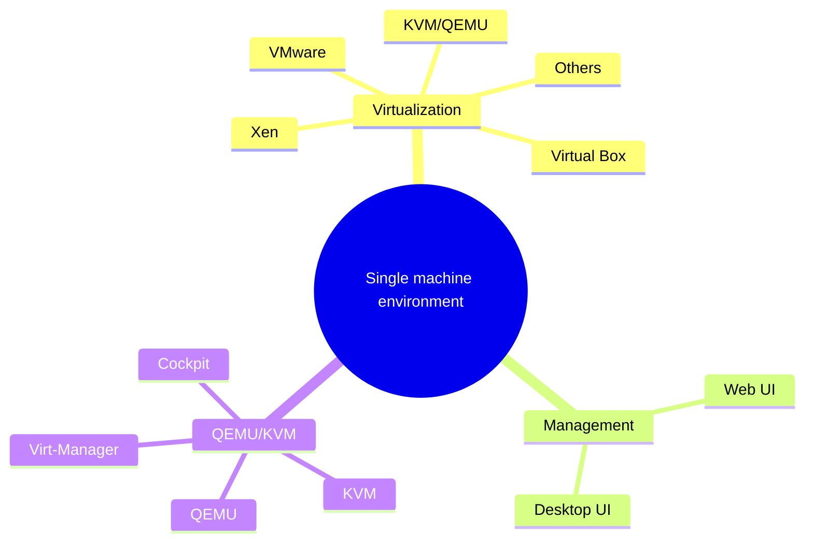
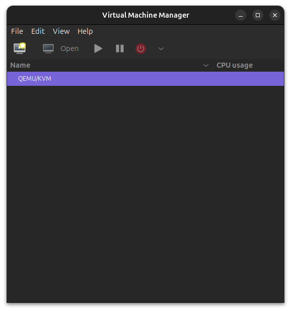
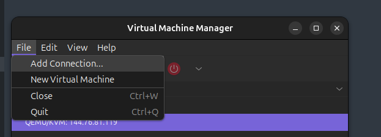
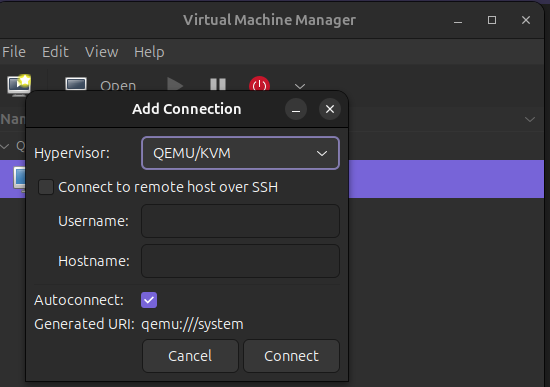
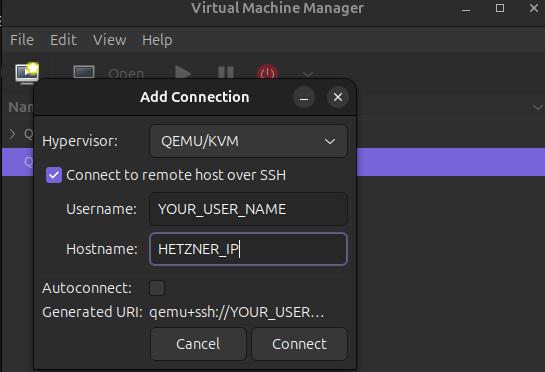
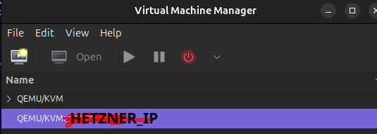
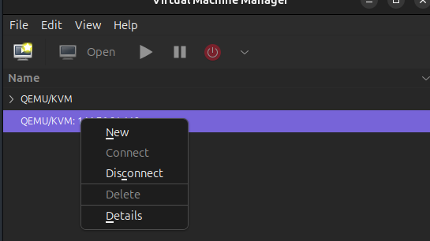

**Example terminology**

Many tutorials will need to include example usernames, hostnames, domains, and IPs. To simplify this, all tutorials should use the same default examples, as outlined below.

* Username: `holu` (short for Hetzner OnLine User)
* Hostname: `<your_host>`
* Domain: `<example.com>`
* Subdomain: `<sub.example.com>`
* IP addresses (IPv4 and IPv6):
   * Server: `<10.0.0.1>` and `<2001:db8:1234::1>`
   * Gateway `<192.0.2.254>` and `<2001:db8:1234::ffff>`
   * Client private: `<198.51.100.1>` and `<2001:db8:9abc::1>`
   * Client public: `<203.0.113.1>` and `<2001:db8:5678::1>`

Do **not** use actual IPs in your tutorial.


## Introduction

Our aim is to have a virtualization platform managed via web user interface.

I would like to add multiple tutorials using single Hetzner machine which will show how to create Virtualized Developer  Platform. In this platform, using KVM/QEMU virtualization, CI, development, test and production servers will be managed in single machine.
Then, if your company is successful, scaling to more hardware will be more easy since migration of virtual machines are very straightforward.

I wonder what will be preferable, a long tutorials or series of short tutorials.
I would like to cover following topics.

1. Installation of KVM/QEMU on a Hetzner server
2. Installation of development, test, production database servers (port forwarding and ssh connection securing)
3. Installation of development, test, production application servers
4. Installation of nginx for reverse proxy of development, test, production servers
5. Installation of CI (Jenkins) Server for automatic deployments
6. Backup of database servers and configuration backup
 
Even the explanation of "what I would like to achieve" is somewhat long.


We will talk a little bit about the virtualization and why we have chosen the tools.
I will try to justify my choices along the way.
The topics, we will be talking about, could be seen in below mermaid mind map diagram.




**Prerequisites**

You should have installed ubuntu 22.04 or 20.04.
See other Hetzner tutorials for this purpose such as

- [Setup Ubuntu 20.04](https://community.hetzner.com/tutorials/setup-ubuntu-20-04)

Copying your ssh keys to your ubuntu server via **ssh-copy-id** would be very useful for more easily connecting to your server.


### Virtualization


Virtualization technology allows us to use multiple virtual machines (VMs) a single physical machine.
Most of the machines Hetzner provides are quite powerful machines.
While apart from database servers, a mid-sized to small-sized company does not need a lot of compute resources.
We can use a single machine rented from Hetzner to virtualize our following needs:

- Web Servers
- Application Servers
- Database servers
- others such as continuous integration servers

All of the above servers will share the single physical machine resources: CPU, memory, and storage.
This technology allows us to optimize our hardware.
We should be able to serve everything we need from a single computer.
And, when/if our company needs scale, we should be able to migrate our virtual machines to physical hardware, starting from database servers.

### Development/Test/Production Servers

We should have 3 versions of our normal servers.

- development
- test
- production


Development versions of our servers should be updated hourly or daily according to how we develop our software.
Test versions will be updated according to our milestones.
If we are following agile methodologies, like scrum, we should update our test servers every sprint (2-3 weeks).
Production servers should be updated only after more testing.

Then we should have following virtual machines for these setup.

- dev-database
- dev-application
- dev-webserver
- test-database
- test-application
- test-webserver
- prod-database
- prod-application
- prod-webserver

For some application environments such ASP.Net MVC, web and application servers should be same.
Then instead of 9 virtual machines, we will have 6 machines like below.


- dev-database
- dev-application
- test-database
- test-application
- prod-database
- prod-application

### Reverse Proxy

Since we have single hardware, we should use reverse proxy to handle incoming connections to our virtual machines.
Nginx or apache httpd could be used as reverse proxy.
Using reverse proxy, our application and web servers will be reachable from the world.
Our database servers should only be reachable from our application servers.
For development database, a web database management system like phpMyAdmin could be installed.


### Continuous integration server

Our plan is to use jenkins continuous integration server for building and deploying our code to the servers.


## Step 1: Installing KVM and QEMU on Server

First check that KVM configuration is possible in your system.

```bash
zgrep CONFIG_KVM /boot/config-$(uname -r)
```

Using following commands, install KVM and QEMU packages.

```bash
sudo apt install qemu-system-x86 libvirt-daemon-system virtinst \
    virt-manager virt-viewer ovmf swtpm qemu-utils guestfs-tools \
    libosinfo-bin tuned
```

### Description of the installed packages

TODO.

## Configuration of KVM/QEMU

First enable lib virt service in your server.

```bash
sudo systemctl enable libvirtd.service
```

Secon check that qemu is working correctly.

```bash
sudo virt-host-validate qemu
```

Your results should be something like below:

```bash
QEMU: Checking for hardware virtualization                                 : PASS
QEMU: Checking if device /dev/kvm exists                                   : PASS
QEMU: Checking if device /dev/kvm is accessible                            : PASS
QEMU: Checking if device /dev/vhost-net exists                             : PASS
QEMU: Checking if device /dev/net/tun exists                               : PASS
QEMU: Checking for cgroup 'cpu' controller support                         : PASS
QEMU: Checking for cgroup 'cpuacct' controller support                     : PASS
QEMU: Checking for cgroup 'cpuset' controller support                      : PASS
QEMU: Checking for cgroup 'memory' controller support                      : PASS
QEMU: Checking for cgroup 'devices' controller support                     : PASS
QEMU: Checking for cgroup 'blkio' controller support                       : PASS
QEMU: Checking for device assignment IOMMU support                         : PASS
QEMU: Checking if IOMMU is enabled by kernel                               : WARN (IOMMU appears to be disabled in kernel. Add intel_iommu=on to kernel cmdline arguments)
QEMU: Checking for secure guest support                                    : WARN (Unknown if this platform has Secure Guest support)
```

In these results, IOMMU support is not enabled.
We need to change our grub settings for this purpose.
Please edit grub file and edit the following lines to it.
Your grub file either should have empty line as following or

> GRUB_CMDLINE_LINUX=""

with some other information.
For me in the Hetzner machine, it was something like below but it may be different for you.

> GRUB_CMDLINE_LINUX="consoleblank=0 systemd.show_status=true"

Add following information "intel_iommu=on iommu=pt" to this line.
Below ... means if something exists there.


> ...
> GRUB_CMDLINE_LINUX="... intel_iommu=on iommu=pt"

Use a text editor like nano below to add above information to your grub file.

```bash
sudo nano /etc/default/grub
```


After adding these lines, update grub and restart your computer.

```bash
sudo update-grub

sudo reboot
```

After your computer starts, run the following command to validate qemu again.

```bash
sudo virt-host-validate qemu
```

After this changes, result of this command is below:

```
QEMU: Checking for hardware virtualization                                 : PASS
QEMU: Checking if device /dev/kvm exists                                   : PASS
QEMU: Checking if device /dev/kvm is accessible                            : PASS
QEMU: Checking if device /dev/vhost-net exists                             : PASS
QEMU: Checking if device /dev/net/tun exists                               : PASS
QEMU: Checking for cgroup 'cpu' controller support                         : PASS
QEMU: Checking for cgroup 'cpuacct' controller support                     : PASS
QEMU: Checking for cgroup 'cpuset' controller support                      : PASS
QEMU: Checking for cgroup 'memory' controller support                      : PASS
QEMU: Checking for cgroup 'devices' controller support                     : PASS
QEMU: Checking for cgroup 'blkio' controller support                       : PASS
QEMU: Checking for device assignment IOMMU support                         : PASS
QEMU: Checking if IOMMU is enabled by kernel                               : PASS
QEMU: Checking for secure guest support                                    : WARN (Unknown if this platform has Secure Guest support)
```

You can also check with following command:

```bash
dmesg | grep -i -e DMAR -e IOMMU
```

In the result of this command, you should see something like following line, which says IOMMU enabled.

> [    0.126918] DMAR: IOMMU enabled  

After this steps, KVM and QEMU would be installed in your server.
See below links for more information on KVM and QEMU.

- [KVM installation in Ubuntu Documentation][1]
- [KVM main page][2]
- [Another KVM installation on Linux][3]


## Step 2 User Interface choices:  Web vs GUI

We can use normal Virt-manager in our server.
But for security and performance considerations, we should not install a desktop environment like KDE or Gnome in our server.
If we want to use GUI tool like Virt-manager, we should install it in our own computer **not Hetzner server**.
Or we could install a web UI like Cockpit and use a web browser to manage our virtual machines.


## Step 2.1 Client GUI: Installing Virt-manager in your own Ubuntu desktop


To repeat, Virt-manager should be installed in **your own computer** not in Hetzner server.
Run following command in your own ubuntu.

```bash
sudo apt install virt-manager
```

Open Virt-manager, you should see following screen.



Open File-> New Connection as below image:



In the opened window:



Choose, 
- check connect remote host over ssh
- enter your username in Hetzner server
- enter IP or hostname or your Hetzner server

see below:




And click Connect.
Your should be able to see your connection like below:



If you use second mouse click, in this connection, you could create a new virtual machine and do other things with your connection.

See below:



In the above image, I have one connection to my localhost desktop and one connection my Hetzner server.


## Step 2.2 Web UI: Cockpit 

sudo apt-get update

sudo apt-get install cockpit

sudo ufw allow 9090/tcp


https://your_server_ip:9090


sudo virsh net-list --all
 Name      State    Autostart   Persistent
--------------------------------------------
 default   active   yes         yes


## Cockpit


https://cockpit-project.org/


https://docs.fedoraproject.org/en-US/fedora-server/virtualization/vm-management-cockpit/
https://docs.oracle.com/en/operating-systems/oracle-linux/cockpit/cockpit-kvm_create_a_virtual_machine.html

## Step 3: Installation of example virtual machines 

## Step 3.1: ISO image installation (Free Dos)


https://www.freedos.org/download/

## Step 3.2: QCOW image installation (Rocky Linux example)

https://rockylinux.org/download

## Step 3.3: OVA image installation (Jenkins Example)

https://bitnami.com/stack/jenkins
https://bitnami.com/stack/jenkins/virtual-machine


## Step 3.4: Installation of VirtualBox Image (Oracle 23ai)


https://www.oracle.com/database/technologies/databaseappdev-vm.html


https://linuxconfig.org/converting-virtualbox-ova-to-qcow2-for-qemu-kvm-deployment

tar

## Step 3.5: Windows development

https://developer.microsoft.com/en-us/windows/downloads/virtual-machines/


## Conclusion

A short conclusion summarizing what the user has done, and maybe suggesting different courses of action they can now take.

## References

[1]: <https://help.ubuntu.com/community/KVM/Installation> "Ubuntu Community KVM installation"
[2]: <https://www.linux-kvm.org/page/Main_Page> "KVM Main Page"
[3]: <https://sysguides.com/install-kvm-on-linux> "Another KVM installation on Linux"


KVM installation 


##### License: MIT

<!--

Contributor's Certificate of Origin

By making a contribution to this project, I certify that:

(a) The contribution was created in whole or in part by me and I have
    the right to submit it under the license indicated in the file; or

(b) The contribution is based upon previous work that, to the best of my
    knowledge, is covered under an appropriate license and I have the
    right under that license to submit that work with modifications,
    whether created in whole or in part by me, under the same license
    (unless I am permitted to submit under a different license), as
    indicated in the file; or

(c) The contribution was provided directly to me by some other person
    who certified (a), (b) or (c) and I have not modified it.

(d) I understand and agree that this project and the contribution are
    public and that a record of the contribution (including all personal
    information I submit with it, including my sign-off) is maintained
    indefinitely and may be redistributed consistent with this project
    or the license(s) involved.

Signed-off-by: Atilla Özgür ati.ozgur@gmail.com

-->
